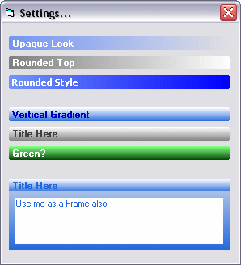



## Header UserControl II

### Description

Vertical Gradient Added. Check out the ScreenShot! Properties Include: Caption/ Font/ FontSize/ FontColor/ Gradient(Vert/Horiz)/ GradientStart Color/ GradientFinish Color/ GradientFinishStyle(Transparent/Opaque) /Shape(Rounded/RoundedTop/Rectangle)
 
### More Info
 

             |
---                |---
**Submitted On**   |2004-04-21 00:55:02
**By**             |[Peter\.](https://github.com/Planet-Source-Code/PSCIndex/blob/master/ByAuthor/peter.md)
**Level**          |Intermediate
**User Rating**    |5.0 (40 globes from 8 users)
**Compatibility**  |VB 5\.0, VB 6\.0
**Category**       |[Custom Controls/ Forms/  Menus](https://github.com/Planet-Source-Code/PSCIndex/blob/master/ByCategory/custom-controls-forms-menus__1-4.md)
**World**          |[Visual Basic](https://github.com/Planet-Source-Code/PSCIndex/blob/master/ByWorld/visual-basic.md)
**Archive File**   |[Header\_Use1735824212004\.zip](https://github.com/Planet-Source-Code/peter-header-usercontrol-ii__1-53296/archive/master.zip)

